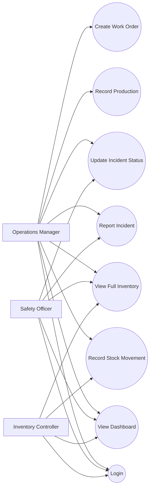
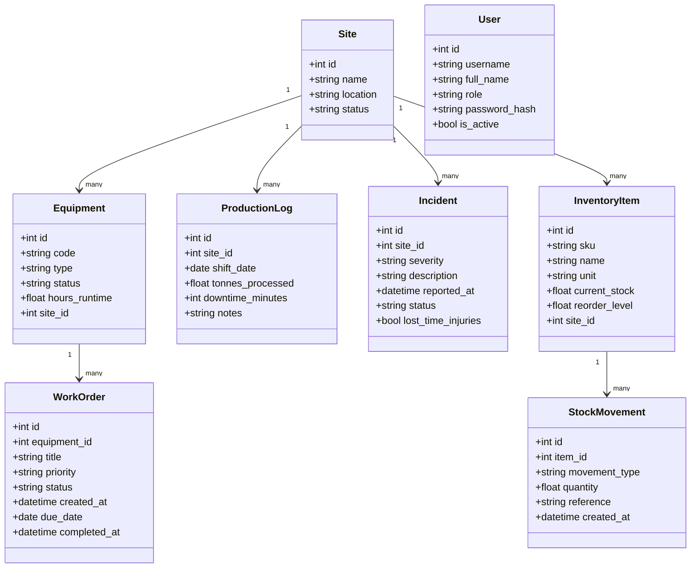
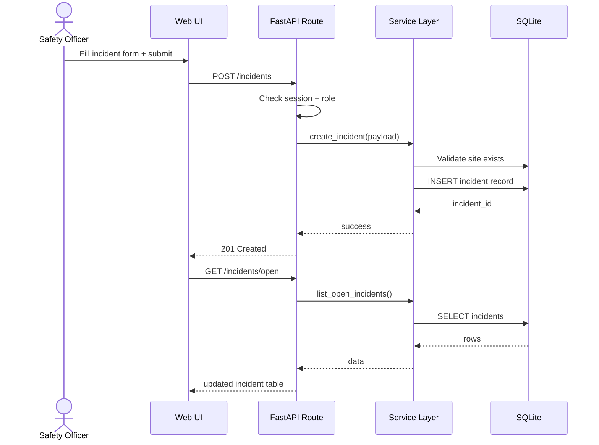
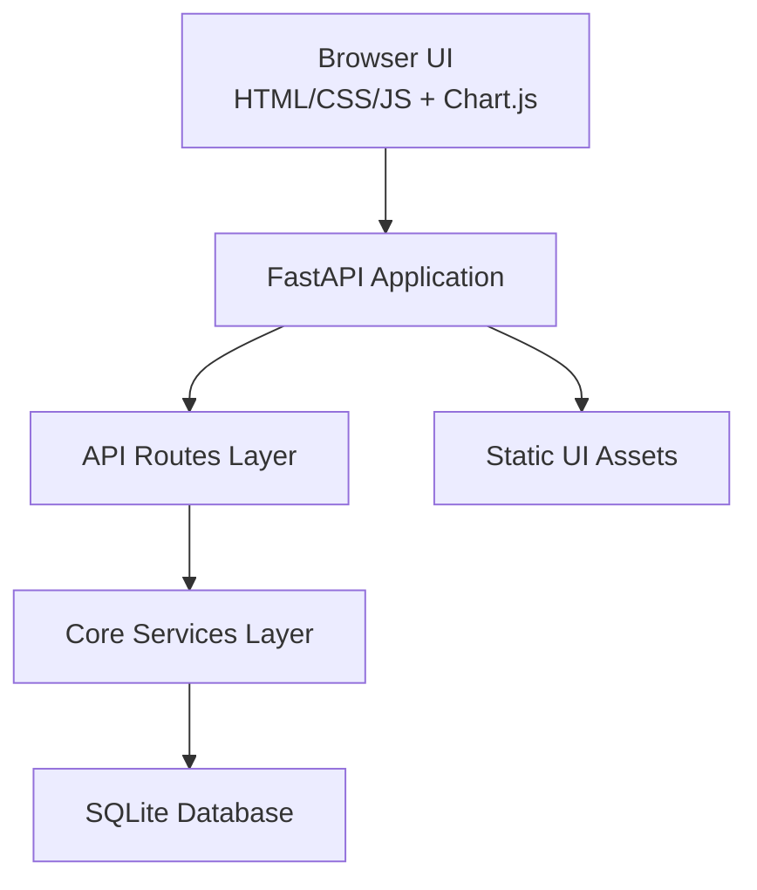

# First Quantum Minerals
# Operational Information System (OIS)
## Technical and User Documentation Manual

**Project Title:** Prototype Operational Information System for Mining Operations  
**Organization Context:** First Quantum Minerals  
**Prepared By:** Student Team  
**Course:** Software Development / Systems Design Project  
**Document Version:** 1.0  
**Date:** 19 April 2026

---

## Document Control

| Version | Date | Authors | Description |
|---|---|---|---|
| 0.1 | 16 Apr 2026 | Team | Initial system specification and architecture draft |
| 0.7 | 18 Apr 2026 | Team | Added implementation, UI, RBAC, and testing evidence |
| 1.0 | 19 Apr 2026 | Team | Final integrated technical and user documentation manual |

---

## Table of Contents
1. Executive Summary  
2. System Overview and Objectives  
3. Requirements Analysis and System Specification  
4. Architecture and Design Decisions  
5. UML Design Artefacts and Explanations  
6. Core Feature Implementation  
7. Error Handling and Troubleshooting Guide  
8. Installation, Configuration, and User Instructions  
9. System Testing and Evaluation  
10. Security, Risk, and Operational Considerations  
11. Maintenance and Support Guide  
12. Conclusion  
13. References (APA)  
14. Appendices  

---

## 1. Executive Summary

This manual documents the design, implementation, and evaluation of a prototype Operational Information System (OIS) developed for a mining enterprise context. The solution supports key operational processes including production tracking, equipment maintenance work-order management, safety incident reporting, and inventory control.

The system has been implemented as a Python-based web application using FastAPI, SQLite, and a responsive browser-based interface. It demonstrates sound application of software engineering principles through layered architecture, requirements traceability, role-based access control, structured error handling, and automated testing.

The prototype includes:
- Production data capture and trend visualization
- Open maintenance work-order management
- Incident recording with severity classification
- Full inventory register and stock movement tracking
- Dashboard analytics and charts
- Session-based login with role restrictions for Manager, Safety Officer, and Inventory Controller

This document serves both as:
- A **technical manual** for maintainers and evaluators
- A **user manual** for system operators and demonstration stakeholders

---

## 2. System Overview and Objectives

### 2.1 Organizational Background

Large mining operations depend on continuous coordination between production, maintenance, safety, and inventory departments. Data is often fragmented across spreadsheets, disconnected systems, and manual communication channels. This leads to delayed decisions, inconsistent records, and weak operational visibility.

The prototype OIS addresses these issues by consolidating core operational data into one coherent system.

### 2.2 Problem Statement

The organization requires a lightweight but functional operational system that:
- Captures daily operational events reliably
- Presents management-level status indicators
- Enforces responsibility boundaries by role
- Supports traceable decision-making and issue response

### 2.3 Project Objectives

1. Design and implement a functional operational software prototype for mining workflows.
2. Provide centralized visibility into production, maintenance, safety, and inventory.
3. Enforce role-based access for key operational actions.
4. Implement robust validation and error handling.
5. Demonstrate software quality through structured tests and documentation.
6. Produce a formal technical and user manual with UML artefacts.

### 2.4 Scope

**In Scope**
- Production log capture
- Work-order creation and status tracking
- Incident capture and status management
- Inventory item management and stock movement records
- Dashboard KPIs and charts
- Role-based authorization (Manager, Safety, Inventory)
- Local deployment and demonstration

**Out of Scope (Prototype Phase)**
- Enterprise SSO/identity provider integration
- Multi-site distributed database replication
- Advanced analytics/forecasting
- Mobile native application
- Full audit/compliance engine

### 2.5 Stakeholders

| Stakeholder | Responsibility | System Interest |
|---|---|---|
| Operations Manager | Oversees production and maintenance | Full dashboard visibility and action authority |
| Safety Officer | Manages incidents and safety workflows | Incident reporting and status progression |
| Inventory Controller | Manages stock and material movements | Inventory balance and stock movement accuracy |
| Technical Team | Maintains software and deployment | Reliability, maintainability, testing quality |
| Academic Evaluators | Assess project quality | Requirements coverage, design quality, evidence |

---

## 3. Requirements Analysis and System Specification

### 3.1 Requirement Elicitation Approach

Requirements were elicited from the assignment brief and translated into business-process-aligned system capabilities. Functional goals were decomposed into user actions and data entities, then mapped to API routes, service-layer operations, and UI workflows.

### 3.2 Functional Requirements

| ID | Requirement |
|---|---|
| FR-01 | The system shall record daily production metrics by site. |
| FR-02 | The system shall create and track maintenance work orders by equipment. |
| FR-03 | The system shall capture safety incidents and support incident status updates. |
| FR-04 | The system shall maintain inventory items and record stock movements. |
| FR-05 | The system shall identify low-stock items against reorder levels. |
| FR-06 | The system shall display a management dashboard with aggregate KPIs. |
| FR-07 | The system shall restrict actions according to user role permissions. |
| FR-08 | The system shall provide responsive UI for desktop and mobile screens. |
| FR-09 | The system shall present charts for production, inventory, and incidents. |

### 3.3 Non-Functional Requirements

| ID | Category | Requirement |
|---|---|---|
| NFR-01 | Usability | Core workflows should be completed by first-time users without training. |
| NFR-02 | Performance | Dashboard and list endpoints should respond within acceptable interactive latency on prototype data. |
| NFR-03 | Maintainability | Architecture shall separate API, business logic, and persistence responsibilities. |
| NFR-04 | Reliability | Invalid user inputs shall be rejected with clear error messages. |
| NFR-05 | Security | Unauthorized actions shall be blocked based on session role. |
| NFR-06 | Portability | System shall run locally on Windows and be deployable to common hosting options. |

### 3.4 Use Case Summaries

1. **Record Production Shift**
- Actor: Operations Manager
- Outcome: Shift metrics stored and reflected in KPI dashboard

2. **Create Maintenance Work Order**
- Actor: Operations Manager
- Outcome: Work-order enters open queue and maintenance visibility

3. **Report Safety Incident**
- Actor: Safety Officer / Manager
- Outcome: Incident appears in open incident queue and severity charts

4. **Record Inventory Movement**
- Actor: Inventory Controller / Manager
- Outcome: Current stock updated; low-stock list recalculated

5. **View Dashboard and Analytics**
- Actor: All authorized roles
- Outcome: Consolidated operational status and visual trends

### 3.5 Data Model (Core Entities)

- Site
- Equipment
- ProductionLog
- WorkOrder
- Incident
- InventoryItem
- StockMovement
- User

### 3.6 Requirements Traceability Matrix

| Requirement | Design Artifact | Implementation | Test Evidence |
|---|---|---|---|
| FR-01 | Use Case, Class, Sequence | `/production-logs` route + service | Unit and API checks |
| FR-02 | Use Case, Class | `/work-orders` route + service | RBAC matrix, functional tests |
| FR-03 | Use Case, Sequence | `/incidents` route + service | RBAC matrix, status checks |
| FR-04 | Class, Sequence | `/inventory-items`, `/inventory-movements` | Stock movement tests |
| FR-05 | Class | `/inventory/low-stock` | Dashboard and list validation |
| FR-06 | Component, Dashboard design | `/dashboard/summary`, UI KPI cards | Manual verification |
| FR-07 | Component security design | Session + role guards | 401/403 matrix outputs |
| FR-08 | UI design artifacts | CSS breakpoints + responsive layout | Device-width checks |
| FR-09 | UI chart design | Chart.js integration | Visual runtime verification |

---

## 4. Architecture and Design Decisions

### 4.1 Architectural Style

The system uses a layered architecture:
- **Presentation/UI Layer:** Static HTML/CSS/JS dashboard and forms
- **API Layer:** FastAPI routes exposing operational endpoints
- **Business Layer:** Service functions implementing validation and rules
- **Persistence Layer:** SQLite schema and CRUD queries

This separation improves testability, maintainability, and logical clarity.

### 4.2 Technology Stack and Rationale

- **Python 3.11+**: Rapid development and readability
- **FastAPI**: Modern API framework with strong validation support
- **Pydantic**: Structured request model validation
- **SQLite**: Lightweight persistence for prototype scope
- **Chart.js**: Lightweight chart rendering for dashboards
- **Pytest**: Fast and expressive unit testing framework

### 4.3 Major Design Decisions

1. **Session-based authentication for prototype simplicity**
- Chosen to avoid external auth dependencies
- Appropriate for local demonstration

2. **Role-based authorization in API layer**
- Ensures server-side enforcement independent of UI
- Prevents privilege escalation through direct API calls

3. **UI and API served from one application origin**
- Simplifies session handling and local deployment

4. **Normalized operational tables**
- Preserves data integrity and relationship clarity

### 4.4 Trade-offs

| Decision | Benefit | Trade-off |
|---|---|---|
| SQLite | Fast setup, no external DB needed | Limited scalability for production |
| Session auth | Simple for local demo | Not enterprise SSO-ready |
| Single app origin | Fewer integration issues | Less flexible than separated frontend/backend deployment |
| Static UI with vanilla JS | Low complexity, easy review | More manual UI logic than framework-based frontends |

### 4.5 Module Structure

- `src/mining_ois/main.py`: App initialization, startup setup, static UI mount
- `src/mining_ois/api/routes.py`: Endpoint definitions and auth checks
- `src/mining_ois/core/models.py`: Pydantic request/response models
- `src/mining_ois/core/services.py`: Business logic and DB operations
- `src/mining_ois/db/database.py`: Schema initialization and seed data
- `src/mining_ois/web/index.html`: Responsive operational dashboard UI
- `tests/test_services.py`: Service-level unit tests

---

## 5. UML Design Artefacts and Explanations

### 5.1 Use Case Diagram



**Explanation**
- The Manager has full operational control.
- Safety role is restricted to incident workflows.
- Inventory role is restricted to stock movement workflows.
- All roles can access dashboard and inventory visibility.

### 5.2 Class Diagram



**Explanation**
- Site is the top-level organizational anchor entity.
- Work orders belong to equipment; stock movements belong to inventory items.
- User entity supports role authorization.

### 5.3 Sequence Diagram (Report Incident)



**Explanation**
- Sequence highlights role check before business operation.
- UI refresh behavior after successful write is represented.

### 5.4 Component Diagram



**Explanation**
- Components show clear layering and dependency flow.
- Static assets are served by FastAPI from mounted UI path.

### 5.5 Diagram-to-Code Alignment

| Diagram Element | Code Mapping |
|---|---|
| API component | `src/mining_ois/api/routes.py` |
| Service component | `src/mining_ois/core/services.py` |
| Data entities | DB schema in `src/mining_ois/db/database.py` |
| UI component | `src/mining_ois/web/index.html` |

---

## 6. Core Feature Implementation

### 6.1 Authentication and Role-based Access

Implemented features:
- Session login endpoint
- Session logout endpoint
- Current user endpoint
- Role guards for protected routes

Role rules:
- **Manager:** production + maintenance + incidents + inventory actions
- **Safety:** incidents only (write scope)
- **Inventory:** stock movement and inventory operations

### 6.2 Production Monitoring

Capabilities:
- Record production shift data
- Persist shift date, tonnes, downtime, notes
- Display historical logs
- Show trend chart in dashboard

### 6.3 Maintenance Work Orders

Capabilities:
- Create work orders with priority and due date
- Update status lifecycle
- Display open queue sorted by urgency

### 6.4 Safety Incident Management

Capabilities:
- Submit incidents with severity and LTI flag
- Update incident status
- Open incident listing and severity chart visualization

### 6.5 Inventory Management

Capabilities:
- Create inventory records
- Record IN/OUT stock movements
- Prevent negative stock on OUT operations
- Display low-stock watchlist and full inventory register

### 6.6 Dashboard and Analytics

Dashboard includes:
- Open work orders count
- Open incidents count
- Low-stock item count
- Total tonnes processed
- Production trend chart
- Inventory-by-site chart
- Incident severity chart

### 6.7 Responsiveness and UX Enhancements

Implemented:
- Multi-breakpoint responsive layout
- Branded header and navigation
- Role-aware section visibility
- Enhanced form cards and visual hierarchy

---

## 7. Error Handling and Troubleshooting Guide

### 7.1 Error Handling Strategy

The system uses layered error handling:
1. Input validation via Pydantic models
2. Business-rule checks in service layer
3. HTTP exception mapping in route handlers
4. UI feedback messages near user actions

### 7.2 HTTP Exception Mapping

| Condition | Code | Example |
|---|---|---|
| Invalid payload format/value | 400 | Invalid priority or movement type |
| Not authenticated | 401 | Accessing protected endpoint without login |
| Not authorized by role | 403 | Safety user creating work order |
| Entity not found | 400/404 equivalent handling | Invalid site/equipment/item ID |

### 7.3 UI Error Feedback

- Form submission failures display messages under the relevant form.
- Authorization failures show clear server-provided details.
- Successful operations trigger confirmation messages and dashboard refresh.

### 7.4 Troubleshooting Matrix

| Symptom | Likely Cause | Resolution |
|---|---|---|
| App not reachable | Uvicorn not running | Start server command and verify port |
| Logo missing | Static asset path mismatch/cache | Verify `/ui/...png`, hard refresh |
| Logout appears ineffective | Cached script/session tab state | Hard refresh, re-open tab |
| 403 on action | Role lacks permission | Use correct role account |
| Test fails on stock movement | Quantity exceeds stock | Use valid quantity or IN movement |

### 7.5 Recovery and Retry Guidance

- Retry transient operation after correcting input.
- For persistent issues, inspect server logs in terminal.
- Reinitialize local environment if dependencies are inconsistent.

---

## 8. Installation, Configuration, and User Instructions

### 8.1 System Requirements

- Windows, Linux, or macOS
- Python 3.11+
- Modern browser (Chrome/Edge/Firefox)

### 8.2 Installation Steps

```powershell
python -m venv .venv
.\.venv\Scripts\Activate.ps1
pip install -e .
```

### 8.3 Run the System

```powershell
uvicorn mining_ois.main:app --reload --app-dir src
```

Access URLs:
- Dashboard UI: `http://127.0.0.1:8000/`
- API docs: `http://127.0.0.1:8000/docs`

### 8.4 User Login Accounts (Prototype)

- `manager / manager123`
- `safety / safety123`
- `inventory / inventory123`

### 8.5 User Workflow Guide

#### 8.5.1 Manager Workflow
1. Login as Manager
2. Review KPI cards and charts
3. Record production shifts
4. Create work orders
5. Review low stock and submit stock movement if required

#### 8.5.2 Safety Workflow
1. Login as Safety
2. Review incident chart and incident table
3. Submit incident reports
4. Update incident status as process progresses

#### 8.5.3 Inventory Workflow
1. Login as Inventory
2. Review full inventory register
3. Record IN/OUT movements
4. Monitor low-stock watchlist

### 8.6 Navigation Guide

Main header provides section links:
- Overview
- KPI
- Charts
- Maintenance
- Incidents
- Inventory
- Data Entry

### 8.7 Technical Configuration Notes

Key runtime setting:
- `OIS_DB_PATH` (optional) controls DB file location

Default:
- `operations.db` in project root

---

## 9. System Testing and Evaluation

### 9.1 Testing Strategy

- Unit tests for service-layer logic
- Functional API checks via live endpoint calls
- Role-permission matrix verification
- Manual UI and responsiveness validation

### 9.2 Test Execution Summary

- Unit tests executed via `pytest`
- Result: all baseline tests passing during development cycle

### 9.3 Functional Test Cases

| Test ID | Scenario | Expected Result | Outcome |
|---|---|---|---|
| TC-01 | Valid login with manager account | 200 + session created | Pass |
| TC-02 | Manager creates work order | 201/200 success response | Pass |
| TC-03 | Safety attempts manager-only action | 403 forbidden | Pass |
| TC-04 | Inventory submits stock movement | 201/200 success | Pass |
| TC-05 | Logout and request `/auth/me` | 401 unauthorized | Pass |
| TC-06 | OUT movement exceeding stock | Validation/business rejection | Pass |

### 9.4 RBAC Validation Matrix

| Role | Production Post | WorkOrder Post | Incident Post | Inventory Movement Post | Post-Logout `/auth/me` |
|---|---:|---:|---:|---:|---:|
| Manager | 200 | 200 | 200 | 200 | 401 |
| Safety | 403 | 403 | 200 | 403 | 401 |
| Inventory | 403 | 403 | 403 | 200 | 401 |

### 9.5 UI Validation Checklist

| Item | Validation |
|---|---|
| Responsive layout | Verified across multiple breakpoints |
| Header/nav consistency | Present across app views |
| Chart rendering | Production, inventory, incidents charts visible |
| Data-entry UX | Enhanced cards and grouped fields functional |
| Logo rendering | Confirmed served from static UI path |

### 9.6 Evaluation Against Objectives

| Objective | Evaluation |
|---|---|
| Build functional prototype | Achieved |
| Enforce role boundaries | Achieved |
| Provide dashboard visibility | Achieved |
| Include error handling | Achieved |
| Provide testing evidence | Achieved |

---

## 10. Security, Risk, and Operational Considerations

### 10.1 Security Posture (Prototype)

Implemented:
- Session-based authentication
- Role-based authorization
- Input validation

Known hardening gaps for production:
- Move static session secret to environment variable
- Upgrade password hashing to adaptive algorithm (bcrypt/argon2)
- Add CSRF protection for state-changing requests

### 10.2 Operational Risks

| Risk | Impact | Mitigation |
|---|---|---|
| Single-file SQLite limitations | Medium | Move to managed RDBMS in production |
| Local-only runtime dependency | Medium | Add containerized deployment path |
| Browser caching confusion | Low | Versioned static asset strategy |

### 10.3 Data Integrity Controls

- Foreign key enforcement enabled in DB
- Numeric checks (e.g., non-negative stock)
- Movement-type and status constraints

---

## 11. Maintenance and Support Guide

### 11.1 Regular Maintenance Tasks

- Update Python dependencies periodically
- Re-run tests before demonstrations or releases
- Validate DB seed assumptions after schema changes
- Review role permissions when adding new endpoints

### 11.2 Deployment Notes

For local demonstration:
```powershell
uvicorn mining_ois.main:app --reload --app-dir src
```

For hosted deployment (future):
- Use managed process runner
- Configure persistent DB storage
- Configure secure secret management

### 11.3 Change Management Recommendations

1. Add change log updates for each feature increment.
2. Expand automated tests when modifying roles/endpoints.
3. Update UML diagrams if architectural flow changes.

---

## 12. Conclusion

The prototype successfully demonstrates an operational information system aligned with enterprise-style software engineering expectations. It covers requirement analysis, architectural design, UML modelling, implementation of core business workflows, role-based controls, exception handling, testing validation, and user/technical documentation.

The resulting system is suitable for academic demonstration and foundational stakeholder review. Future iterations should focus on production-grade security, scalable persistence, and deployment automation.

---

## 13. References (APA)

Chart.js. (n.d.). *Chart.js documentation*. https://www.chartjs.org/docs/latest/  
FastAPI. (n.d.). *FastAPI documentation*. https://fastapi.tiangolo.com/  
Object Management Group. (2017). *Unified Modeling Language (UML), Version 2.5.1*. https://www.omg.org/spec/UML/2.5.1/  
Python Software Foundation. (n.d.). *Python documentation*. https://docs.python.org/3/  
SQLite. (n.d.). *SQLite documentation*. https://www.sqlite.org/docs.html  

---

## 14. Appendices

### Appendix A: API Catalogue

| Endpoint | Method | Purpose | Auth |
|---|---|---|---|
| `/auth/login` | POST | Login and start session | No |
| `/auth/logout` | POST | End session | Yes |
| `/auth/me` | GET | Get current session user | Yes |
| `/dashboard/summary` | GET | KPI summary | Yes |
| `/production-logs` | GET/POST | View/create production logs | Role dependent |
| `/work-orders` | POST | Create work order | Manager |
| `/work-orders/open` | GET | View open work orders | Yes |
| `/incidents` | POST | Create incident | Manager/Safety |
| `/incidents/open` | GET | View open incidents | Yes |
| `/inventory-items` | GET/POST | View/create inventory item | Role dependent |
| `/inventory-movements` | POST | Record stock movement | Manager/Inventory |
| `/inventory/low-stock` | GET | Low-stock listing | Yes |

### Appendix B: Recommended Screenshot Index

1. Login page with branding and logo
2. Dashboard KPI cards
3. Production trend chart
4. Inventory by site chart
5. Incident severity chart
6. Maintenance table
7. Incidents table
8. Full inventory register
9. Data entry forms (role-specific views)
10. API docs page

### Appendix C: Marking Checklist Coverage

| Assignment Requirement | Section(s) |
|---|---|
| Requirements analysis and system specification | Section 3 |
| System design using UML | Section 5 |
| Implementation of core features | Section 6 |
| Error handling and exception management | Section 7 |
| System testing and validation | Section 9 |
| User and technical documentation | Sections 8 and 11 |

### Appendix D: Expansion Plan to 50+ Pages (if formatting expands less than expected)

If the formatted output is below the required page minimum, extend with:
1. Detailed use case narratives (full main/alternate flows)
2. Extended test evidence tables with screenshots
3. Interface walkthrough screenshots by role
4. Endpoint-by-endpoint data dictionary
5. Additional architecture alternatives and rationale
6. Risk register with likelihood/impact scoring

---

**End of Manual**
